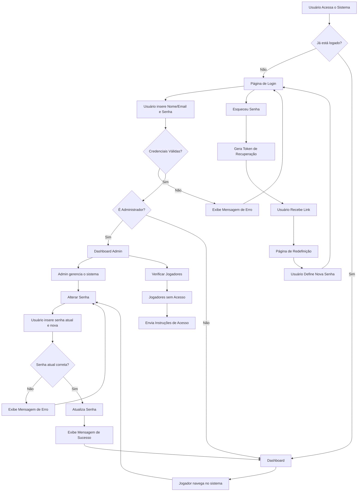
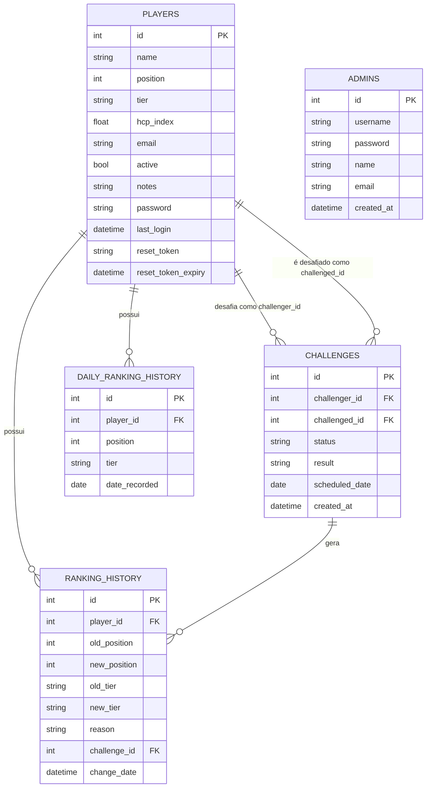

# Sistema de Liga Olímpica de Golfe


## Sobre o Projeto

Sistema web para gerenciar a Liga Olímpica de Golfe 2025, possibilitando o acompanhamento do ranking em formato de pirâmide, agendamento e gestão de desafios entre jogadores, e histórico de posições.

## Funcionalidades

- 🏆 Ranking em formato de pirâmide
- 🎮 Sistema de desafios entre jogadores
- 📊 Histórico de posições e evolução dos jogadores
- 👤 Gerenciamento de jogadores e handicaps
- 🔒 Sistema de autenticação de usuários
- 👑 Painel administrativo
- 📱 Design responsivo

## Requisitos

- Python 3.8+
- Flask
- SQLite3
- Bibliotecas Python (veja `requirements.txt`)

## Instalação

1. Clone o repositório
```bash
git clone https://github.com/seuusuario/liga-olimpica-golfe.git
cd liga-olimpica-golfe
```

2. Instale as dependências
```bash
pip install -r requirements.txt
```

3. Execute a aplicação
```bash
python app.py
```

4. Acesse a aplicação
```
http://localhost:5000
```

## Sistema de Autenticação

### Visão Geral

O sistema de autenticação permite que jogadores acessem a plataforma usando credenciais personalizadas. Cada jogador tem uma senha inicial baseada nas 3 primeiras letras do seu nome em minúsculas.

### Fluxo de Autenticação



### Estrutura do Banco de Dados

O sistema utiliza SQLite3 como banco de dados, com as seguintes tabelas:



### Credenciais iniciais

- **Jogadores**: Senha inicial = 3 primeiras letras do nome em minúsculas (ex: para "João Silva" -> "joã")
- **Administrador**: username: `admin`, senha: `123`

## Principais Rotas

| Rota                     | Descrição                                     | Autenticação Necessária |
|--------------------------|-----------------------------------------------|-----------------------|
| `/`                      | Página inicial com ranking                    | Não                   |
| `/login`                 | Página de login                              | Não                   |
| `/logout`                | Encerra a sessão                             | Sim                   |
| `/dashboard`             | Painel do jogador                            | Sim                   |
| `/admin`                 | Painel administrativo                        | Sim (Admin)           |
| `/change_password`       | Alterar senha                                | Sim                   |
| `/forgot_password`       | Recuperação de senha                         | Não                   |
| `/pyramid_dynamic`       | Visualização da pirâmide                     | Não                   |
| `/challenges/calendar`   | Calendário de desafios                       | Não                   |
| `/player/<id>`           | Detalhes do jogador                          | Não                   |
| `/player/<id>/ranking_history` | Histórico do jogador                   | Não                   |

## Implementando o Sistema de Autenticação

Para implementar o sistema de autenticação, verifique se:

1. As colunas necessárias foram adicionadas à tabela `players`:
   - `password` (TEXT)
   - `last_login` (DATETIME)
   - `reset_token` (TEXT)
   - `reset_token_expiry` (DATETIME)

2. A tabela `admins` foi criada com as colunas:
   - `id` (INTEGER PRIMARY KEY)
   - `username` (TEXT NOT NULL UNIQUE)
   - `password` (TEXT NOT NULL)
   - `name` (TEXT NOT NULL)
   - `email` (TEXT)
   - `created_at` (DATETIME DEFAULT CURRENT_TIMESTAMP)

3. O administrador padrão foi criado:
   - username: `admin`
   - senha: `123`

4. As rotas adequadas foram protegidas com o decorador `@login_required`

5. A função `create_authentication_tables()` é chamada durante a inicialização da aplicação

## Estrutura de Diretórios

```
liga-olimpica-golfe/
├── app.py                  # Arquivo principal da aplicação
├── static/                 # Arquivos estáticos (CSS, JS, imagens)
├── templates/              # Templates HTML
│   ├── base.html          # Template base
│   ├── login.html         # Página de login
│   ├── dashboard.html     # Dashboard do jogador
│   ├── admin_dashboard.html # Dashboard administrativo
│   ├── ...                # Outros templates
├── golf_league.db          # Banco de dados SQLite
├── import_data.py          # Script para importação de dados
└── README.md               # Este arquivo
```

## Segurança

- Senhas armazenadas com hash SHA-256
- Proteção de rotas sensíveis
- Tokens de redefinição de senha com validade de 24 horas
- Verificação de permissões de administrador

## Contribuição

Sinta-se à vontade para contribuir com o projeto através de pull requests ou reportando issues.

## Licença

Este projeto é licenciado sob [sua licença aqui].

## Contato

[Seu nome/email/informações de contato]